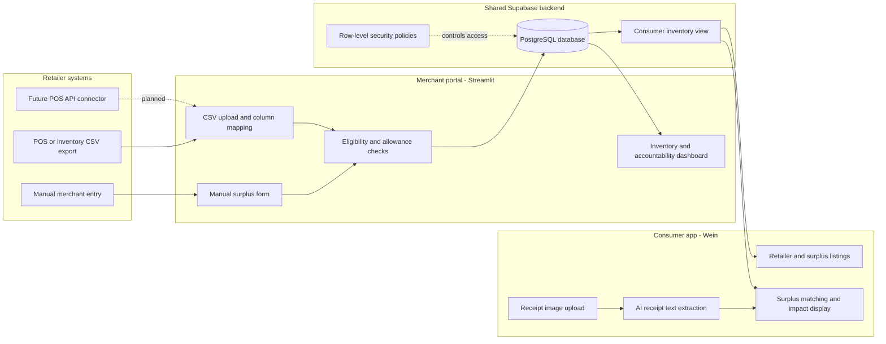
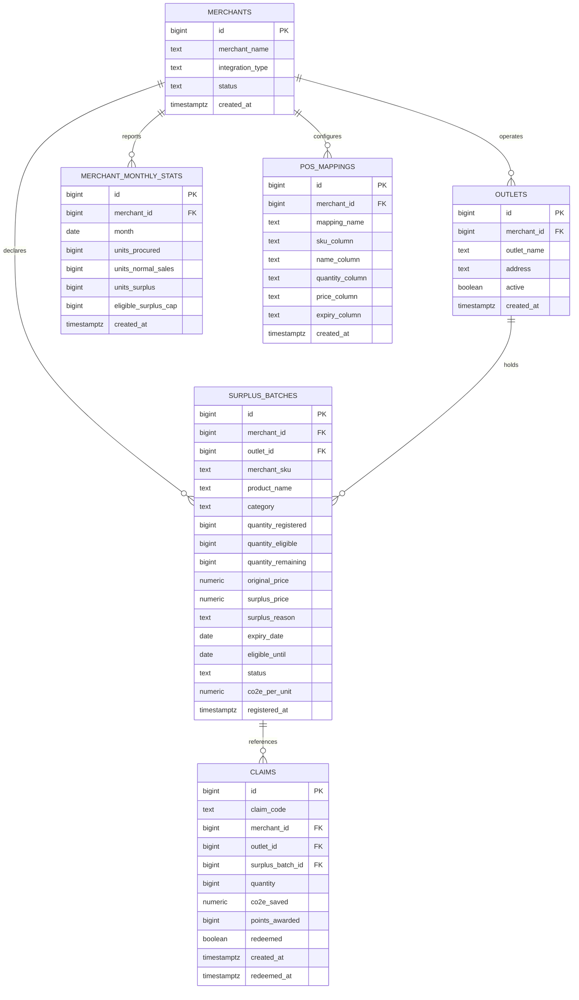
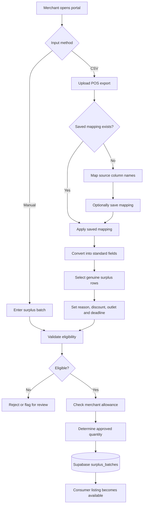
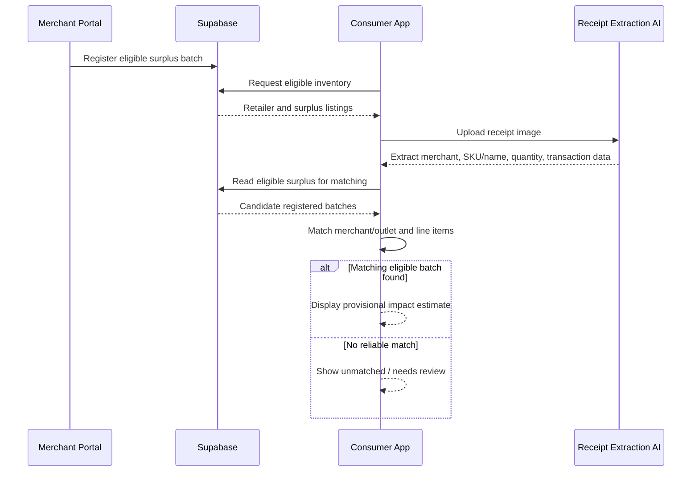
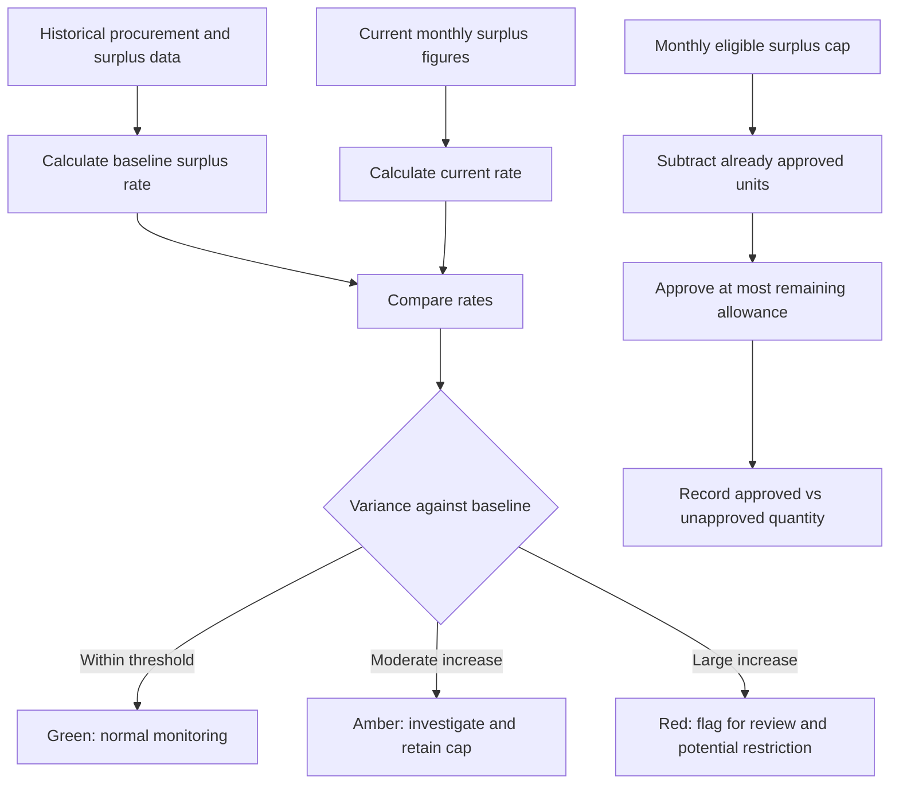

# Circular Quest — System Design and Technical Documentation

**Project type:** Sustainability hackathon MVP  
**Focus:** SDG 12 — Circular retail and responsible consumption  
**Document version:** 1.0  
**Status:** Merchant prototype operational; consumer integration in progress

> **Scope:** Circular Quest does not include GIS, a board game, or mandatory QR claims in the current MVP. Receipt scanning is AI-assisted. The merchant-side POS integration is CSV/manual, not a live commercial POS connector.

## 1. Executive summary

Circular Quest connects participating retailers with consumers interested in purchasing verified surplus inventory. Merchants register surplus manually or upload inventory exports from different POS systems. The merchant portal standardises disparate CSV column names, allows merchants to select eligible surplus, and publishes approved inventory into a shared Supabase database. The consumer app displays retailers and their available surplus, extracts purchase details from uploaded receipt images using AI, matches those details to registered surplus, and displays an **estimated** environmental impact.

The project aims to redirect collectible-driven engagement toward reducing waste. Trading cards and points are part of the broader product concept, but their complete issuance/redemption workflow is not yet confirmed as implemented.

### Goals

1. Onboard merchants without requiring them to replace their POS systems.
2. Maintain a consistent surplus inventory data model across retailers.
3. Give consumers visibility into participating retailers and eligible stock.
4. Support AI-assisted receipt extraction and surplus matching.
5. Demonstrate safeguards against retailers declaring unlimited surplus.
6. Provide a practical foundation for future retailer API integrations.

### Non-goals for the hackathon MVP

- Direct integration with commercial POS vendors.
- Production-grade proof of receipt authenticity or purchase provenance.
- Full carbon life-cycle assessment for every SKU.
- GIS/location-based exploration or board-game mechanics.
- Payment processing or a commercial e-commerce checkout.

## 2. High-level system architecture



**Interpretation:** The merchant portal writes normalised surplus batches; the consumer app reads a restricted, eligible inventory projection. The two apps communicate through shared backend data, not direct app-to-app calls.

## 3. Technology stack

| Layer | Technology | Purpose | Status |
|---|---|---|---|
| Merchant frontend | Python + Streamlit | Dashboard, forms, CSV importer, inventory and accountability | Implemented |
| Merchant data handling | Pandas | CSV parsing, field mapping, type conversion, previews | Implemented |
| Shared backend | Supabase PostgreSQL | Relational storage, joins, data consistency | Implemented |
| Database client | `supabase-py` | Read/write database operations from Streamlit | Implemented |
| Deployment | GitHub + Streamlit Community Cloud | Source control and hosted merchant portal | Implemented |
| Secrets | Streamlit Secrets | Stores Supabase URL and client key outside GitHub | Implemented |
| Consumer inventory interface | Supabase view `consumer_inventory` | Filters and joins eligible surplus for consumer display | Proposed / verify deployment |
| Consumer frontend | Wein's app | Retailer listing, receipt upload, impact results | Under development; exact framework TBD |
| Receipt AI | Model/OCR service selected by consumer team | Extract merchant, products, quantities and transaction details | Planned / consumer-side implementation TBD |
| Access control | Supabase RLS and future merchant authentication | Restrict data visibility and writes | Prototype policies only; hardening pending |
| Future API integration | HTTP API or Supabase Edge Functions | Accept standardised submissions from POS partners | Proposed |

### Current GitHub merchant app dependencies

```text
streamlit
supabase
pandas
```

The consumer team's framework and AI provider should be documented after Wein confirms them. Do not assume a particular model or API is already integrated.

## 4. Application components

### 4.1 Merchant portal

**Dashboard:** Shows active surplus units, active batches, merchant integration type, eligibility allowance and accountability status.

**Register Surplus:** Allows a merchant to enter SKU, product name, category, quantity, original and surplus prices, reason, expiry date and eligibility end date. Performs prototype validation and inserts the batch into Supabase.

**POS Upload:** Accepts CSV exports, allows mapping of source columns to Circular Quest fields, saves reusable mappings, standardises rows, allows merchants to select genuine surplus, and applies eligibility/allowance checks before insertion.

**Inventory:** Displays registered batches, quantities, eligibility, prices and status.

**Accountability:** Displays historical surplus rates, baseline comparisons, current caps and anomaly indicators.

**Important limitations:** The demo merchant selector is not authentication. The current eligibility rules are illustrative; the current cap allocation is performed in application code, not a database transaction. These limitations matter if multiple merchants or simultaneous uploads use the system.

### 4.2 Consumer application

Expected functions, subject to confirmation from Wein:

1. Display participating retailer names and surplus inventory.
2. Let consumers upload or photograph a receipt.
3. Use AI to extract merchant/outlet, transaction details and line items.
4. Match extracted line items against registered surplus.
5. Show quantities and illustrative estimated CO2e impact.
6. Potentially display points and trading-card progress as part of the larger game concept.

**Critical distinction:** Receipt text extraction is not receipt authentication. A receipt mentioning a discounted SKU does not prove the specific unit was registered surplus. Exact matching should be described as a demo-level eligibility check, not fraud-proof verification.

## 5. Database design

### 5.1 Entity relationship diagram



`claims` was created during an earlier QR-based prototype design. It is **not the current AI receipt verification workflow**; retain it as legacy/prototype schema until the team decides whether a transaction-verification table is required.

### 5.2 Key table semantics

| Table | Row represents | Main consumer use |
|---|---|---|
| `merchants` | One participating retailer company | Merchant name |
| `outlets` | One retailer branch | Outlet name |
| `surplus_batches` | A declared surplus quantity at one outlet, for one SKU/batch | Product, price, availability, eligibility |
| `pos_mappings` | One reusable source-to-standard CSV field mapping | None; merchant-only |
| `merchant_monthly_stats` | Merchant monthly procurement/sales/surplus summary | None; merchant-only |
| `claims` | A legacy purchase-claim record | Not used by current receipt flow |

**Quantity definitions:** `quantity_registered` is the merchant-declared amount; `quantity_eligible` is the amount approved for incentives; `quantity_remaining` is the remaining eligible quantity available for display. `quantity_remaining` should never be treated as total physical stock at the retailer.

### 5.3 Consumer inventory contract

The proposed `consumer_inventory` view exposes only the required joined and filtered fields:

| Field | Meaning |
|---|---|
| `batch_id` | Unique surplus batch |
| `merchant_id`, `merchant_name` | Retailer identity |
| `outlet_id`, `outlet_name` | Branch identity |
| `merchant_sku`, `product_name`, `category` | Product identification |
| `quantity_remaining` | Available eligible units |
| `original_price`, `surplus_price` | Display prices |
| `eligible_until` | Eligibility deadline |
| `co2e_per_unit` | Optional illustrative environmental factor |

Recommended eligibility filter:

```sql
where sb.status in ('active', 'partially_eligible')
  and sb.quantity_remaining > 0
  and sb.quantity_eligible > 0
  and sb.eligible_until >= current_date
  and m.status = 'active'
  and o.active = true
```

A view created with `security_invoker = true` respects the underlying table permissions. It still requires appropriate SELECT policies on source tables; avoid granting consumer access to sensitive merchant statistics or write operations.

## 6. Workflow diagrams

### 6.1 Merchant onboarding and CSV normalisation



### 6.2 Consumer discovery and receipt scan



**Receipt matching is provisional.** Without POS transaction verification or a merchant-generated purchase token, the system cannot establish authenticity, stop reusing a receipt, or safely deduct inventory based on a photo alone.

### 6.3 Merchant accountability



The Green/Amber/Red thresholds and seven-day near-expiry rule are **demonstration heuristics**, not validated universal policy. A real system needs category-specific rules, audit evidence, exemptions for unusual events, and enforcement at the database/service layer.

## 7. POS interoperability design

### 7.1 Source schemas

**FreshBasket sample:**

```csv
SKU,ItemName,QtyLeft,ExpiryDate,RetailPrice
YOG101,Strawberry Yogurt,12,2026-10-12,2.80
```

**Retailer B sample:**

```csv
product_code,description,remaining_stock,use_by,standard_price
FRU991,Banana Pack,14,2026-10-12,3.60
```

Both are mapped into the common structure:

```json
{
  "merchant_sku": "YOG101",
  "product_name": "Strawberry Yogurt",
  "quantity": 12,
  "original_price": 2.80,
  "expiry_date": "2026-10-12"
}
```

The mapping is saved **per merchant and format**. A future upload with the same columns can reuse it. A mapping does not automatically prove the products are surplus: the merchant must select the relevant rows and provide surplus details before registration.

### 7.2 Import validation

Recommended checks include:

- Required fields present and mapped to distinct source columns.
- SKU and product name not blank.
- Quantity is a positive whole number.
- Prices are non-negative and surplus price is below original price.
- Dates are parseable and deadlines have not passed.
- Duplicate SKU/batch rows are detected and reviewed.
- Product category and surplus reason are validated independently.
- Approved quantities do not exceed remaining monthly allowance.
- Every import produces a per-row success/error summary.

**Current simplification:** The bulk importer assumes the `Food` category and uses a shared reason/discount/deadline for selected rows. Category-specific mapping and row-level editing are recommended future improvements.

## 8. Receipt extraction and environmental impact

### 8.1 Extraction contract (proposed)

```json
{
  "merchant": "FreshBasket",
  "outlet": "FreshBasket Orchard",
  "transaction_id": "FB-001",
  "purchase_date": "2026-10-09",
  "items": [
    {
      "sku": "YOG101",
      "product": "Strawberry Yogurt",
      "quantity": 2
    }
  ]
}
```

Receipt images may not contain SKU, outlet or unique transaction identifiers. Missing fields must remain unknown, not fabricated. Prefer matching merchant/outlet and exact SKU when available; name-only matching should be marked lower-confidence and reviewed for ambiguous cases.

### 8.2 Estimated impact

For the demo, if a category factor has been explicitly provided:

```text
illustrative_impact_kg_co2e = matched_quantity * co2e_per_unit
```

**This is not automatically actual CO2e saved.** Manufacturing emissions are generally already incurred, and avoided emissions depend on the disposal counterfactual, displacement and system boundaries. Existing `co2e_per_unit` values were entered as prototype placeholders and must be labelled illustrative. If no defensible factor is available, show `Impact estimate unavailable`.

## 9. Security, data integrity and limitations

The current application uses a **demo merchant selector** and has used permissive anonymous read/write policies for rapid testing. This is not appropriate for a public production deployment. The publishable Supabase key is not itself an authorisation boundary.

Minimum requirements before wider public exposure:

1. Merchant authentication and merchant-to-account ownership checks.
2. Restrict inserts/updates to the authenticated merchant's own rows.
3. Expose consumers only to the minimum read-only inventory fields.
4. Use server-side transactions/functions for concurrent cap allocation and stock changes.
5. Avoid granting anonymous writes to `surplus_batches`, `pos_mappings`, `claims` or accounting tables.
6. Never commit Supabase secret/service-role keys or database passwords to GitHub.
7. Minimise receipt storage and personal information; apply retention and deletion policies.

**Known integrity gaps:** Current Streamlit-side cap checks can race under concurrent submissions. A user could potentially resubmit a CSV or the same batch multiple times. AI-extracted receipts can be edited, reused or misclassified. These limitations should be disclosed in the demo rather than described as solved.

## 10. Deployment and repository

### Merchant repository structure (current)

```text
circular-quest-merchant/
├── app.py              # Streamlit merchant portal
├── requirements.txt    # Python dependencies
└── README.md           # Project overview, optional
```

### Recommended future structure

```text
circular-quest-merchant/
├── app.py
├── database.py
├── services/
│   ├── eligibility.py
│   ├── pos_mapping.py
│   └── accountability.py
├── pages/
│   ├── dashboard.py
│   ├── inventory.py
│   └── pos_upload.py
├── tests/
├── requirements.txt
└── PROJECT_DOCUMENTATION.md
```

### Streamlit Secrets

```toml
SUPABASE_URL = "https://YOUR_PROJECT_REF.supabase.co"
SUPABASE_KEY = "YOUR_PUBLISHABLE_OR_ANON_KEY"
```

Set these through Streamlit Community Cloud secrets, not source code. The consumer app should use its own configuration while pointing to the **same Supabase project**.

## 11. Integration contract between teammates

| Responsibility | Merchant developer | Consumer developer |
|---|---|---|
| Merchant/outlet registration | Owns | Reads names |
| Surplus creation and eligibility | Owns | Reads eligible batches |
| CSV POS mapping | Owns | No dependency |
| Consumer listing schema | Agree and maintain | Implement display |
| Receipt extraction | No dependency | Owns |
| Receipt-to-surplus matching | Defines product identifiers | Implements matching |
| CO2e methodology | Stores validated factor if available | Displays appropriately labelled result |
| Inventory changes after purchase | Requires verified transaction integration | Must not decrement stock from unverified OCR |

**Minimum shared fields:** `batch_id`, `merchant_id`, `merchant_name`, `outlet_id`, `outlet_name`, `merchant_sku`, `product_name`, `category`, `quantity_remaining`, `original_price`, `surplus_price`, `eligible_until`, `co2e_per_unit`.

**Suggested first end-to-end test:** Register a new eligible product in the merchant portal, confirm it appears in `consumer_inventory`, show it in the consumer app, scan a controlled sample receipt, and display a correctly labelled provisional match and illustrative impact. Also test a non-surplus item and an expired batch.

## 12. Testing and acceptance criteria

| Test | Expected outcome | Status |
|---|---|---|
| Load merchant dashboard | Merchant-specific inventory and metrics display | User-confirmed working |
| Manually register surplus | New batch appears in Supabase | User-confirmed working |
| Upload FreshBasket CSV | Source columns map to standard fields | User-confirmed working |
| Save and reuse FreshBasket mapping | Mapping persists in `pos_mappings` | User-confirmed working |
| Upload Retailer B CSV | Different schema normalises successfully | User-confirmed working |
| Apply eligibility and allowance checks | Correctly handles representative test batches | Implemented; broader testing needed |
| Consumer inventory view | Shows only currently eligible products | Integration pending verification |
| Consumer receipt scan | Extracts receipt and matches registered surplus | Consumer-side testing pending |
| Reused/fake receipt rejected | Prevents duplicate or fabricated rewards | Not implemented |
| Concurrent registration does not exceed cap | Database-level cap integrity | Not implemented |

## 13. Roadmap

### Immediate hackathon integration

- Confirm the shared Supabase project and field names with Wein.
- Create/test `consumer_inventory` with the required SELECT permissions.
- Register a demo surplus batch and verify it appears in the consumer app.
- Scan a sample receipt and show a provisional match and illustrative CO2e result.
- Prepare a scripted demonstration of two different POS CSV formats.

### After the hackathon

- Merchant login and robust RLS policies.
- Transaction-level purchase verification and anti-replay controls.
- Database-enforced cap allocation and inventory updates.
- Category-specific eligibility rules and carbon methodology.
- API connectors for POS partners and automated stock reconciliation.
- Auditable merchant reporting, fraud monitoring and operational analytics.

## 14. Demo narrative

1. **Different merchant systems:** FreshBasket uploads `SKU, ItemName, QtyLeft`; Retailer B uploads `product_code, description, remaining_stock`.
2. **One standard:** Circular Quest maps both formats into common surplus fields and saves the mappings.
3. **Verified registration (prototype):** Merchants select surplus, enter reason and price, and the app applies eligibility and monthly allowance rules.
4. **Shared inventory:** The consumer app displays eligible products from the same Supabase database.
5. **Consumer interaction:** AI extracts items from a sample receipt and compares them with registered surplus.
6. **Transparent impact:** The app displays an illustrative CO2e estimate or states that no validated factor is available.
7. **Responsible design:** Explain the cap and anomaly dashboard, while acknowledging remaining receipt and merchant-fraud limitations.

## 15. Key design decisions

| Decision | Rationale |
|---|---|
| Web-based merchant portal | Quick deployment and access without installing POS software |
| Manual + CSV before live APIs | Works across merchants with different technical maturity |
| Saved per-merchant column mappings | Reduces repeated setup for recurring exports |
| Batch-level surplus records | Same SKU can be normal at one outlet and surplus at another |
| Shared Supabase database | Avoids syncing two separate app databases |
| Consumer read-only inventory projection | Reduces coupling and unnecessary data exposure |
| AI receipt extraction instead of QR | Faster hackathon consumer flow, with explicit authenticity limitations |
| Frozen baseline and allowance caps | Demonstrates safeguards against rewarding unlimited surplus |
| Illustrative impact labels | Avoids overstating scientifically unsupported carbon savings |

---

**Project summary:** Circular Quest's demonstrated technical contribution is a POS-agnostic merchant ingestion workflow built around saved CSV mappings, batch-level eligibility and a shared inventory database. The consumer integration extends this foundation through surplus discovery and AI-assisted receipt matching. Commercial POS integrations, secure purchase verification and validated environmental accounting remain future work.
