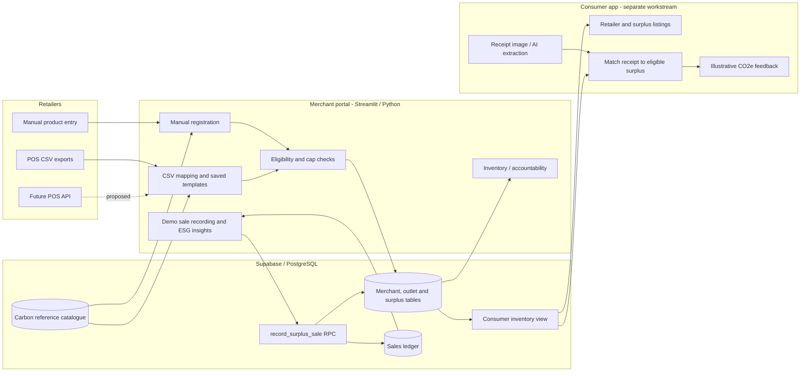
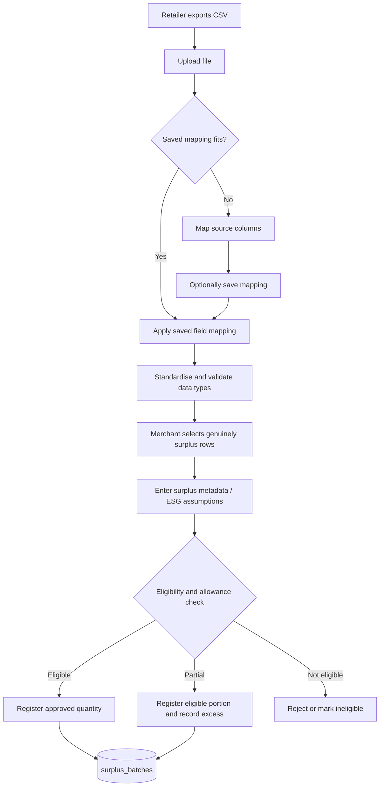
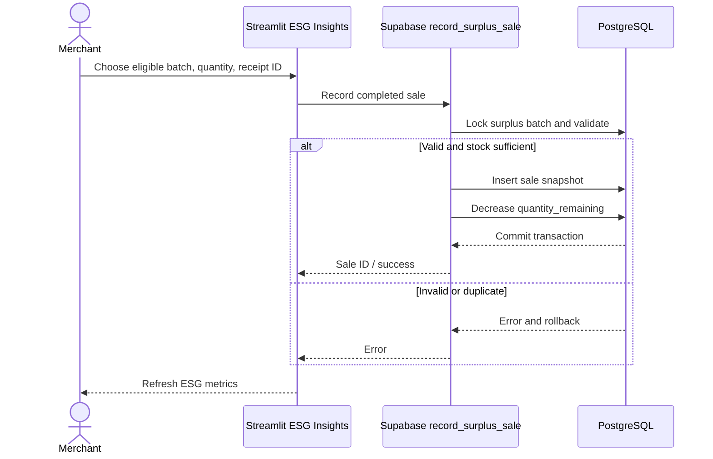
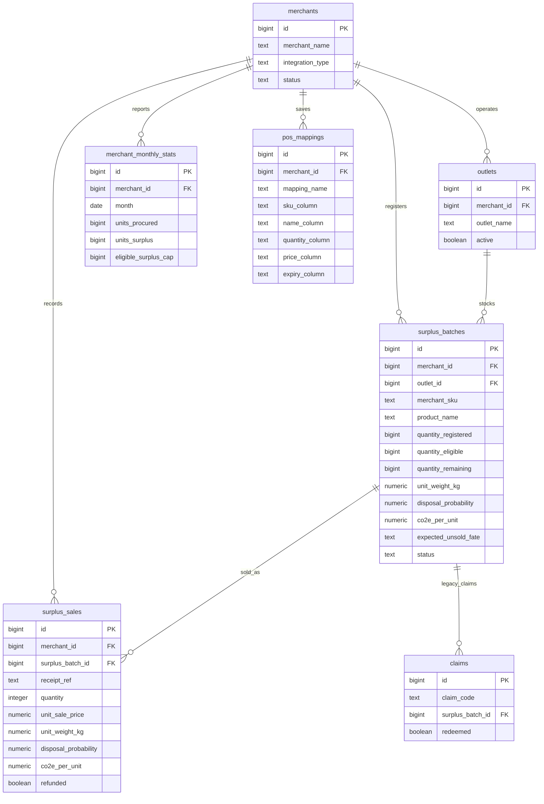
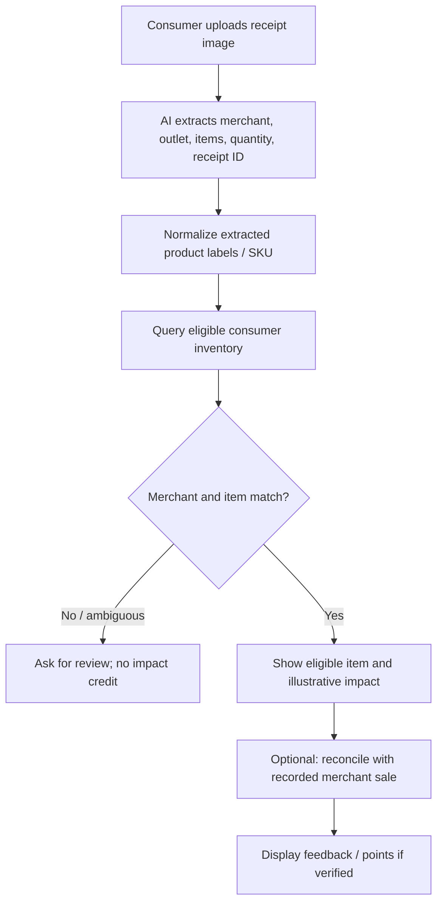
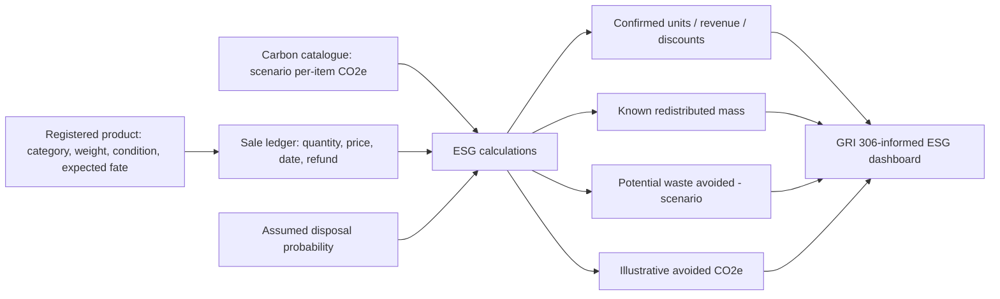
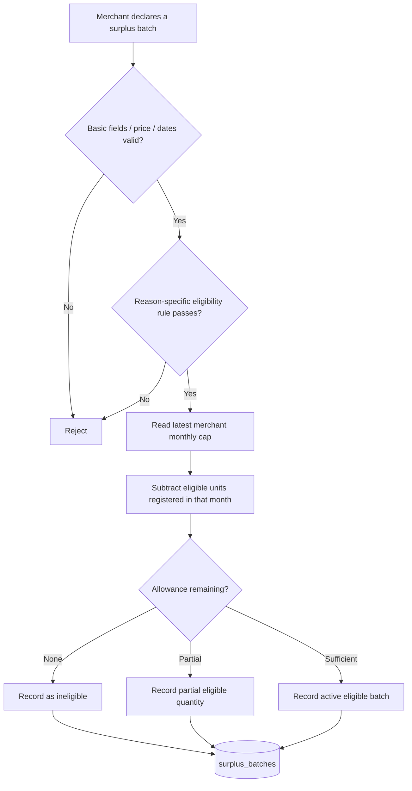

# Circular Quest — System Architecture & Technical Documentation

**Version:** 2.0 · **Updated:** 9 October 2026  
**Project:** SDG 12 circular retail hackathon prototype  
**Repository:** `circular-quest-merchant` · **Backend project:** `SDG Project` (Supabase)

> **Scope and status:** This document describes the supplied merchant `app.py`, `ESG_SETUP.sql`, the carbon catalogue, and the intended consumer integration. The merchant-side features have been implemented in the supplied prototype code; live production deployment, consumer integration, external POS connections, and scientifically validated carbon savings are **not** asserted. No GIS, board game, or mandatory QR code is part of the current scope.

## 1. Executive summary

Circular Quest is a two-sided platform for redistributing **eligible retail surplus**. Merchants register surplus manually or import exports from differently structured POS/inventory systems. A shared Supabase backend stores merchant, outlet, inventory, carbon-reference, and transaction information. The consumer app (developed separately by Wein) is intended to display participating retailers and available surplus and use AI to extract purchased items from receipt images. Environmental information is displayed as **illustrative estimates**, not certified carbon savings.

The merchant portal also records demo surplus sales and generates **GRI 306-informed** business metrics: confirmed units sold, revenue recovered, discounted value, redistributed mass, scenario-based potential waste avoidance, and illustrative avoided CO₂e.

### Objectives

1. Support retailers with different POS column formats without replacing their existing systems.
2. Distinguish ordinary inventory from pre-declared, eligible surplus batches.
3. Expose consistent surplus inventory for a separate consumer interface.
4. Monitor merchant surplus levels against a historical allowance.
5. Capture completed sales and produce transparent, auditable **prototype** ESG metrics.
6. Separate observed activity from modelled environmental impact.

## 2. High-level architecture



**Key design choice:** The consumer app does not need to know whether a batch was entered manually or imported from a CSV. It reads the same standardised inventory fields.

## 3. Technology stack

| Layer | Technology | Purpose | Status |
|---|---|---|---|
| Merchant UI | Streamlit | Web-based merchant dashboard and forms | In supplied code |
| Backend logic | Python | Validation, transformations, calculations | In supplied code |
| CSV processing | Pandas | Parse, map and standardise POS exports | In supplied code |
| Database | Supabase PostgreSQL | Shared relational persistence | Set up in project |
| Client library | `supabase-py` | Python database queries and RPC calls | In supplied code |
| Database function | PostgreSQL PL/pgSQL | Transactional demo checkout | In supplied SQL |
| Carbon catalogue | CSV imported to `carbon_reference` | Reference footprints and scenario estimates | Imported by team |
| Deployment | GitHub + Streamlit Community Cloud | Source control and hosting | Used by team |
| Consumer UI | Separately developed app | Browse inventory, scan receipts, display impact | Integration to verify |
| Receipt recognition | AI-based image extraction | Parse merchant, items, quantities, transaction ID | Consumer-side plan |
| Commercial POS API | Not connected | Potential future automation | Future |

**Secrets:** `SUPABASE_URL` and `SUPABASE_KEY` are stored in Streamlit Secrets, not in committed source code. Use a publishable/anon key, not a service-role key.

## 4. Functional modules

### 4.1 Merchant selection and dashboard

The demo merchant selector switches among fictional merchants such as GreenMart, FreshBasket and EcoGrocer. The dashboard reads active/partially eligible batches, remaining quantities, the latest allowance and accountability indicators. **This selector is not merchant authentication.**

### 4.2 Manual surplus registration

A merchant chooses an outlet and supplies SKU, name, category, quantity, normal/surplus prices, reason, expiry and eligibility dates. The ESG-enhanced version additionally collects item weight, condition, expected unsold fate, and an assumed disposal probability. The merchant may select an item-based carbon reference from the catalogue. Validation precedes insert into `surplus_batches`.

### 4.3 POS CSV mapping and bulk registration

The importer accepts CSV exports with different column names. A merchant maps SKU, product name, quantity, price and expiry date to the Circular Quest schema; the mapping can be saved in `pos_mappings`. Merchants then **select which rows are actually surplus** rather than automatically declaring the entire POS export surplus. Selected batches undergo eligibility and allowance checks before insertion. Product-category and carbon selection are handled in the enhanced workflow.



**Example mappings:** `ItemName` and `description` both become `product_name`; `QtyLeft` and `remaining_stock` both become `quantity`.

### 4.4 Inventory management

Displays registered, eligible and remaining units, status, price, category, deadline, and illustrative CO₂e per unit when available. `quantity_registered` is **not** interchangeable with `quantity_eligible` or `quantity_remaining`.

### 4.5 Surplus accountability

Uses `merchant_monthly_stats` for historical procurement/sales/surplus rates and monthly caps. The dashboard flags deviations as green/amber/red based on **prototype thresholds**, not an externally certified audit methodology. The cap is intended to prevent unlimited incentive eligibility as surplus rises.

**Limitations:** Historical data are supplied by merchants; the prototype does not independently verify procurement or prevent deliberate misclassification. App-level allowance checks are not a production-grade concurrency or anti-fraud control.

### 4.6 ESG Insights and demo sales ledger

The ESG page records a simulated **completed sale** using an eligible batch, quantity and unique merchant receipt/transaction reference. It calls `record_surplus_sale` in Supabase. The database function locks the batch row, checks eligibility/stock, inserts a snapshot into `surplus_sales`, and reduces remaining inventory **within one transaction**. This is not a real POS integration or independent receipt verification.



## 5. Database design



### Main tables and responsibilities

| Table / view | Function |
|---|---|
| `merchants` | Merchant profile, integration type and status |
| `outlets` | Branches linked to merchants |
| `surplus_batches` | Canonical registered inventory, eligible stock and ESG metadata |
| `pos_mappings` | Merchant-specific reusable CSV column mappings |
| `merchant_monthly_stats` | Historical procurement, sales, surplus and caps |
| `carbon_reference` | General product/category carbon footprints and scenario avoided-CO₂e estimates |
| `surplus_sales` | Completed demo transactions with price, mass and emissions snapshots |
| `claims` | Earlier QR-claim prototype schema; **not required** for current receipt-AI approach |
| `consumer_inventory` | Intended filtered read interface for consumer listings; verify that the view exists in deployed Supabase |

`carbon_reference` is a lookup catalogue and **not necessarily linked through a foreign key** to `surplus_batches`. The app selects a reference and copies its per-item estimate to the batch; that is a snapshot, not a persistent relational join.

### Important batch fields

- `quantity_registered`: Merchant-declared surplus units.
- `quantity_eligible`: Units approved for Circular Quest incentives.
- `quantity_remaining`: Eligible stock still available for sale.
- `unit_weight_kg`: Product mass per sold item; may be null.
- `product_condition`: New, near-expiry, refurbished, etc., as merchant-declared.
- `expected_unsold_fate`: Disposed, donated, stored, or unknown.
- `disposal_probability`: Scenario assumption between 0 and 1; should be supported by historical records in a real deployment.
- `co2e_per_unit`: **Illustrative scenario-based avoided CO₂e**, not the full product lifecycle footprint.
- `registered_at`, `eligible_until`, `status`: Registration and eligibility lifecycle.

## 6. Consumer integration contract

The consumer app is intended to read **only** approved, currently available surplus, with fields such as:

```json
{
  "batch_id": 101,
  "merchant_name": "FreshBasket",
  "outlet_name": "FreshBasket Orchard",
  "merchant_sku": "YOG101",
  "product_name": "Strawberry Yogurt",
  "category": "Food",
  "quantity_remaining": 10,
  "original_price": 2.80,
  "surplus_price": 1.68,
  "eligible_until": "2026-10-13",
  "co2e_per_unit": null
}
```

*Example values are illustrative and not a claim about live data.*

Recommended inventory filter: merchant and outlet active; batch status `active` or `partially_eligible`; `quantity_remaining > 0`; `quantity_eligible > 0`; `eligible_until >= current_date`. The view can enforce these filters; the consumer must not rely on UI filtering alone.

### Receipt recognition workflow (planned / to validate)



**Crucial distinction:** AI extraction does **not** prove that a receipt is authentic, unique, or that the sold units were part of a specific surplus batch. Matching product names alone is weaker than transaction-level verification. The current demo sales ledger and consumer receipt scanning are not automatically linked unless a shared receipt ID and reconciliation flow are explicitly implemented and tested. Do not claim verified redemption or fraud prevention until that exists.

## 7. ESG reporting design (GRI 306-informed)

The teammate's ESG proposal distinguishes **confirmed redistribution**, **potential waste prevention**, and **estimated environmental impact**. This follows the spirit of GRI 306: Waste 2020, but does **not** mean the output is a compliant or audited GRI 306 disclosure. GRI 306-4 requires waste diversion information and supporting classification; ordinary surplus sales do not automatically qualify as reported waste diverted from disposal.

### Input → calculation → output



### Calculation definitions

Let sale `i` have quantity `qᵢ`, discounted unit price `pᵢ`, original unit price `oᵢ`, item mass `wᵢ`, assumed disposal probability `dᵢ`, and illustrative avoided CO₂e factor `eᵢ`. The calculations below exclude refunded sales.

| Metric | Formula | Evidence status |
|---|---|---|
| Confirmed units sold | `Σ qᵢ` | Recorded demo sales; not independently POS verified |
| Revenue recovered | `Σ qᵢ × pᵢ` | Based on recorded sales prices |
| Customer discount value | `Σ qᵢ × max(0, oᵢ − pᵢ)` | Based on listed vs sale prices |
| Known redistributed mass (kg) | `Σ qᵢ × wᵢ` for known weights | Recorded/merchant-supplied weights |
| Potential waste avoided (kg) | `Σ qᵢ × wᵢ × dᵢ`, only if expected fate = `Disposed` | Scenario estimate, **not verified waste diversion** |
| Illustrative avoided CO₂e (kg) | `Σ qᵢ × eᵢ` for known factors | Scenario estimate, **not certified GHG savings** |

Unknown weights or carbon factors are **excluded** from their respective totals and disclosed as missing coverage, not silently treated as measured zero. The ESG page reports missing unit counts.

### Worked example (hypothetical)

Two yogurts sold; item mass `0.15 kg`, original price `S$2.80`, surplus price `S$1.68`, expected unsold fate `Disposed`, assumed disposal probability `0.50`:

- Confirmed units: **2**.
- Revenue recovered: `2 × 1.68 = S$3.36`.
- Discount value: `2 × (2.80 − 1.68) = S$2.24`.
- Redistributed mass: `2 × 0.15 = 0.30 kg`.
- Potential waste avoided: `2 × 0.15 × 0.50 = 0.15 kg` (**scenario only**).
- Illustrative CO₂e: `2 × e`, only if an appropriate per-item factor `e` was selected.

### Carbon catalogue methodology and limitations

The expanded `carbon_reference` dataset contains **552 entries** spanning general retail categories and package variants. Some entries derive from published lifecycle references; others are category proxies or illustrative assumptions. The catalogue's `assumed_displacement_factor` is a modelling assumption, not an observed probability. The dataset's `avoided_co2e_kg_per_item` therefore **must not be presented as verified emissions saved**.

The app uses **item-based references** for `co2e_per_unit`. A reference measured per kilogram requires actual item weight and unit conversion; it must not be treated as per item automatically. Product lifecycle footprints are not identical to emissions avoided by selling already-produced surplus.

### Reporting mapping

| Prototype output | Potential GRI 306 relevance | Caveat |
|---|---|---|
| Surplus reason, category, condition | GRI 306-1 / 306-2 narrative | Merchant declarations need validation |
| Measures to prevent and manage waste | GRI 306-2 | Describe processes, not just totals |
| Recorded mass sold | Supporting circularity indicator | Not equivalent to waste generated under 306-3 |
| Potential waste avoided | Supporting estimate | Not automatically GRI 306-4 waste diverted |
| Disposal records | Could inform GRI 306-5 | Actual disposal evidence not captured comprehensively |

## 8. Merchant eligibility and accountability logic



Prototype thresholds include a configurable-in-principle **seven-day near-expiry check** and an illustrative green/amber/red historical surplus comparison. The existing implementation uses the latest monthly statistics row; this is suitable for a controlled demo but is not an audited forecasting or procurement baseline.

**Known issue:** The eligibility check, registration, and allowance summation are not performed as one database transaction. Two concurrent registrations could over-allocate the cap. This requires server-side enforcement before production.

## 9. Data quality, integrity and security

- **Demo-only merchant selection:** Users can select another merchant; no merchant login isolation is enforced in the prototype.
- **RLS:** Supabase policies govern access. Some earlier demonstration policies allow anonymous reads/writes; these must be tightened before public use.
- **Sale RPC:** `record_surplus_sale` uses a `SECURITY DEFINER` function with demo permissions. It is not a production-safe merchant authorization model.
- **Receipts:** Receipt AI is subject to OCR errors, ambiguity, reuse, alteration and unmatched product names.
- **Carbon factors:** Sources, system boundaries and displacement assumptions must be reviewed for real claims.
- **ESG:** Merchant-entered disposal assumptions do not prove that waste was prevented.
- **Refunds:** The schema contains a `refunded` flag and the dashboard excludes flagged sales; the current merchant UI does not implement a full verified refund/reversal workflow.
- **Data reconciliation:** Procurement, inventory and POS history can be compared in future, but the demo does not automatically verify those records against independent sources.

## 10. Deployment and setup

### Required repository files

```text
circular-quest-merchant/
├── app.py                         # Merchant Streamlit app
├── requirements.txt               # streamlit, supabase, pandas
├── PROJECT_DOCUMENTATION.md       # This document (rename on upload)
└── README.md                      # Optional short project landing page
```

### Supabase configuration

1. Create or reuse the `SDG Project` Supabase project.
2. Confirm tables `merchants`, `outlets`, `surplus_batches`, `merchant_monthly_stats`, `pos_mappings`, and `carbon_reference` exist.
3. Import the expanded carbon CSV into `carbon_reference` with the expected columns.
4. Run `ESG_SETUP.sql` to add batch ESG fields, create `surplus_sales` and the `record_surplus_sale` function.
5. Use `DEMO_FIX_FRESHBASKET.sql` **only for fictional, unsold demo batches** if their test dates/allowances need resetting; never use it on real goods or completed transactions.
6. Configure appropriate RLS read/write permissions for the demo; do not mistake these for production security.
7. Configure Streamlit Secrets: `SUPABASE_URL` and `SUPABASE_KEY`.
8. Deploy `app.py` on Streamlit Community Cloud using the GitHub repository.
9. Verify the optional `consumer_inventory` view exists before telling the consumer developer to query it; it is not created by `ESG_SETUP.sql`.

### Dependencies

```text
streamlit
supabase
pandas
```

## 11. End-to-end demonstration and acceptance checklist

| # | Test | Expected result |
|---|---|---|
| 1 | Switch demo merchant | Dashboard changes to selected merchant's records |
| 2 | Register manual eligible surplus | New batch saved with eligible quantity and dates |
| 3 | Upload FreshBasket CSV | Map source columns and preview standardised fields |
| 4 | Save POS mapping | Mapping reappears on next upload |
| 5 | Upload alternate retailer CSV | Different column names map to same schema |
| 6 | Select only surplus rows | Nonselected inventory is not registered |
| 7 | Exceed monthly allowance | Excess units are marked ineligible or partial |
| 8 | Select item-based carbon reference | `co2e_per_unit` saved for new batch |
| 9 | Record demo sale | Sales ledger gains row and stock decreases atomically |
| 10 | Reuse same receipt ID and batch | Database uniqueness constraint prevents duplicate |
| 11 | Open ESG Insights | Sales-based metrics and missing-factor warnings display |
| 12 | Consumer queries eligible inventory | Only available, unexpired, eligible items appear (if view configured) |
| 13 | Consumer AI parses sample receipt | Item matching works; unresolved items are not auto-credited |

**Evidence note:** These are acceptance tests to execute; inclusion here does **not** assert that every test has been performed successfully.

## 12. Current boundaries and roadmap

**Implemented in the supplied merchant code:** merchant switching, dashboard, manual registration, CSV import, saved mappings, inventory listing, prototype accountability, carbon-reference selection, ESG Insights, and demo sale recording via the supplied SQL RPC.

**Needs joint validation with Wein:** shared inventory view, receipt extraction schema, matching logic, treatment of duplicates/refunds, and how/when CO₂e or points are awarded.

**Future improvements:** authenticated merchant accounts; merchant-specific RLS; server-side cap allocation; real POS API/webhooks; verifiable receipt transaction matching; carbon-factor provenance and category-specific waste pathways; audited GRI 306 evidence and reporting; and comprehensive refund handling.

## 13. Suggested hackathon demonstration script

1. **Merchant A:** Enter a surplus batch manually and show its eligibility status.
2. **Merchant B:** Upload a differently structured CSV, map columns and save the POS mapping.
3. **Reusability:** Reupload the file and apply the saved mapping automatically.
4. **Accountability:** Show how the monthly allowance caps eligible inventory despite higher reported surplus.
5. **Carbon catalogue:** Select an item-based reference and explain the illustrative nature of its factor.
6. **Sale:** Record a simulated transaction and show the corresponding stock decrement.
7. **ESG Insights:** Show confirmed units, revenue, mass and separate scenario estimates.
8. **Consumer handoff:** Demonstrate the separate consumer app reading eligible stock and, if working, AI parsing a test receipt.

### Closing technical claim

> Circular Quest demonstrates a standardised data layer for retailers with heterogeneous POS exports, a shared consumer-facing surplus catalogue, and a transparent distinction between recorded surplus sales and estimated environmental outcomes. Commercial POS integrations, verified receipt provenance and audited carbon/ESG claims remain future work.
